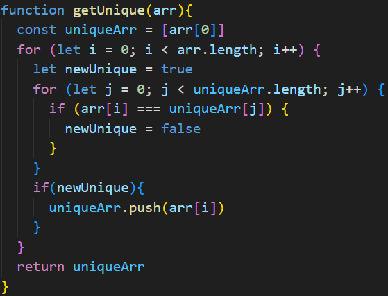
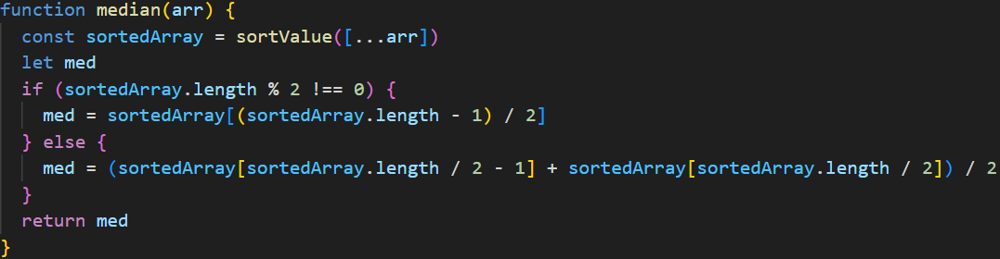
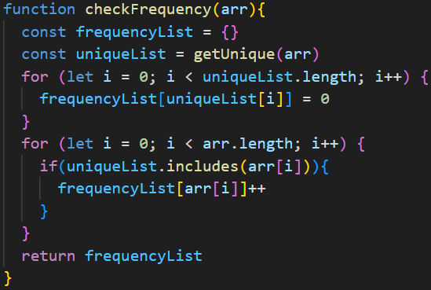
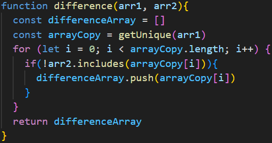
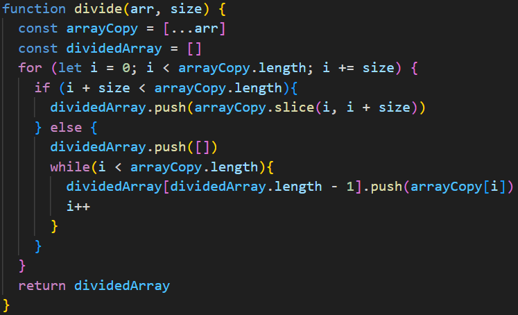

# Kodkvalitetskrav

| Namn | Förklaring | Reflektion och regler från Clean Code |
|---|---|---|
| createArray(arrayLength) | Funktion som skapar en array av nummer som längden är beroende av det man skickar in. | **Use Intention-Revealing Names:** Förklarar tydligt att den skapar en array. **Don't be cute:** Namnet använder sig inte av något guligt ord eller skämt. Det berättar exakt vad den gör. | 
| removeNullUndefined(arr) | Funktion som tar bort null och undefined från en array. | **Method names:** Använder verbet "remove" för att säga vad den gör vilket är att tar bort null och undefined. **Use Intention-Revealing Names:** Förklarar tydligt att den tar bort null och undefined. | 
| getUnique(arr) | Funktion som tarbort dubbletter från en array. | **Avoid Disinformation:** Funktionen tar bort dubbletter så namnet ljuger lite så det skulle vara bättre om det hade ett namn som "removeDuplicates()" | 
| nth(arr, n) | Funktion som ger ut varje nth (t.ex tredje eller fjärde) element i en array. Nth är vad användaren skickar in. | **Use Pronounceable Names:** Nth är inte lätt att utala. **Use Searchable Names:** nth kan ge resultat på andra delar av koden med ord som slutar på "nth".| 
| divide(arr, size) | Funktion som delar upp en array i flera mindre arrayer och lägger in det i en ny array. Dem mindre arrayernas storlek skickar man in tillsammans med arrayen. | **Avoid Disinformation:** Kan förväxlas med matematik och division. **Make Meaningful Distinctions:** Det är inte helt klart hur funktionen delar upp den. Skulle kunna få ett mer tydligt namn. | 

| Metodnamn | Länk eller kod | Antal rader | Reflektion |
|---|---|---|---|
| getUnique(arr) |  | 13 | **Have No Side Effects:** Tar bort dubbletter och ger tillbaka dem unika värdena i arrayen och modifierar inte arrayen på något sätt. | 
| median(arr) |  | 8 | **Small!:** Är relativt liten. **Have No Side Effects:** Ger medianen av arrayen och modifierar inte arrayen på något sätt.|
| checkFrequency(arr) |  | 11 | **Structured Programming:** Har bara en return sats. **Use Descriptive Names:** Förklarar att den kollar på frekvensen av element i en array men den borde nog lägga till "get" i börjar så att man vet att den hämtar ut det. |
| difference(arr1, arr2) |  | 8 | **Small!:** Är relativt liten. |
| divide(arr, size) |  | 14 | **Dyadic Functions:** Använder sig av två inskickade argument vilket man inte ska försöka göra men i detta fallet går det inte att ha mindre argument. |
